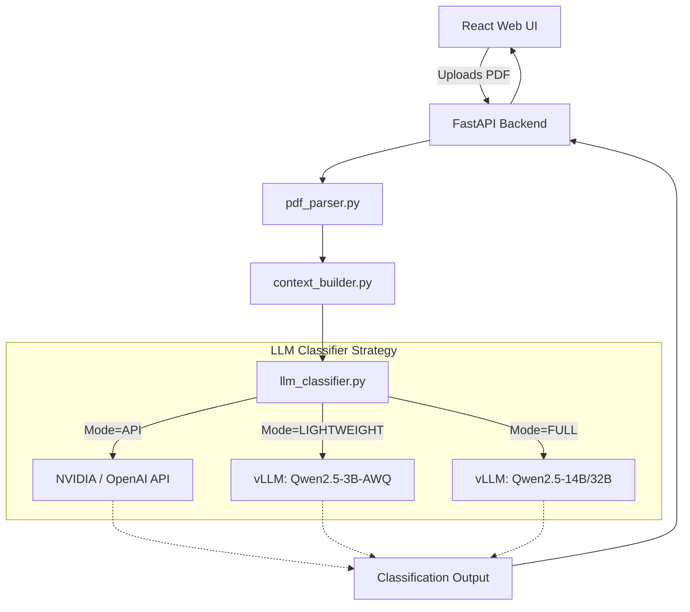

# Project Description
In this project we had to search data citations in scientific articles and classify them into one of two categories: **Primary** or **Secondary**.

# Definitions
- **Primary** - raw or processed data generated as part of the paper, specifically for the study
- **Secondary** - raw or processed data derived or reused from existing records or published data

# Our approach

## 1. PDFs reading
### a) Pages and blocks concatenating
For removing most broken context between different pages or blocks in articles all text was read by blocks (using `page.get_text('dict')` from `fitz`) and recollected using some features of the text design in PDFs. The main feature for regrouping text was the font size. Then new blocks of text were sorted by font size in descending order and concatenated in full text. 

### b) DOIs extracting
All DOIs were extracted in two ways:
- In articles where links were clickable, DOI citations were found in a structure of PDF files.
- In other articles links were extracted by regex approach with post-filtering.

### c) IDs extracting
Many accession IDs were extracted in a simple way using regexes for different databases. For "dangerous" cases (**GenBank**, **PDB**, **CATH** etc.) identifiers were searched in a neighbourhood of keywords for corresponding databases.

## 2. Citations filtering
### a) Dangerous IDs filtering
After extracting dangerous identifiers were verified by LLM (**Qwen2.5 14B-instruct-awq**).

### b) DOIs data/article prefiltering
DOI links were filtered by types of prefixes. Dataset of types of DOI-prefixes (**DataCite**, **CrossRef**, **Medra** etc.) were obtained using DOI API.

## 3. Context creating
### a) Main context
The main context was extracted from the text using dynamic window which size calculated as `max(400 // number_of_mentions, 75)`.

### b) Table context
At first, accession IDs were clusterized by simple density-based algorithm based on start positions in the text. Then in a neighbourhood of these clusters were searched the number of table (if it exists).
The order of blocks of text could be changed because of technique of PDFs reading. So before texts recollecting, accession IDs were marked by searching table mentions in a neighbourhood of identifiers. If the identifier was mentioned inside the table, main context was replaced by mentioning this table in the text.

### c) Authors extracting
From the first pages were extracted names of authors using NER-model from **spacy**.

## 4. LLM classification
### a) Extra-filtering
DOI citations had an extra-filtering for data/article by **Qwen2.5 32B-instruct-awq**.

### b) Primary/Secondary classification
DOI links were classified using **Qwen2.5 32B-instruct-awq** and accession IDs by **Qwen2.5 14B-instruct-awq** (it was much better than 32B for IDs).

---

# Production Deployment & Web Application

This repository features a FastAPI backend and a modern React (Vite) frontend.

## Features
- **Robust PDF Parsing**: Leverages PyMuPDF to extract text with visual layouts intact.
- **Hybrid Extraction**: Combines Regex (for Accession IDs) and explicit PDF hyperlink extraction (for DOIs).
- **Intelligent Context Clustering**: Extracts dynamic text windows around citations and handles tabular data structures effectively.
- **LLM Strategy Pattern**: Easily switch between 3 LLM deployment modes depending on your hardware:
  - `API`: Fast inference using cloud endpoints (NVIDIA, Together, Groq).
  - `LIGHTWEIGHT`: Runs on consumer GPUs (e.g., RTX 4050 6GB VRAM) using Qwen2.5-3B-Instruct-AWQ.
  - `FULL`: Runs the original Kaggle pipeline (Qwen 14B + 32B) for maximum accuracy on enterprise hardware.
- **Web UI**: Drag-and-drop web interface built with React (Vite) featuring modern glassmorphism.

## Quick Start (Docker Compose)

The easiest way to run the entire stack (API Backend + React Frontend) is via Docker.

1. Ensure Docker and Docker Compose are installed.
2. Create a `.env` file in the root directory (you can copy `.env.example`) and fill in your API key:
   ```bash
   LLM_MODE=API
   NVIDIA_API_KEY="your-api-key"
   ```
3. Run the stack:
   ```bash
   docker-compose up --build
   ```
4. Open the Web UI: http://localhost:3000

## Local Development (uv)

This project uses `uv` for fast dependency management.

### Backend Setup
```bash
# Install dependencies
uv sync

# Ensure your .env file is created and configured

# Run the FastAPI server
uv run python run.py
```

### Frontend Setup
```bash
cd frontend
npm install
npm run dev
```

## Architecture

