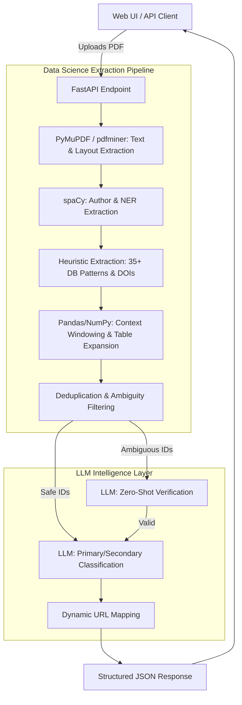

# Scientific Data Citation Extractor

An advanced Data Science and NLP pipeline designed to identify, extract, and intelligently classify data citations and database accession IDs directly from scientific articles in PDF format. Developed as a solution for the Kaggle competition [**Make Data Count - Finding Data References**](https://www.kaggle.com/competitions/make-data-count-finding-data-references).

You can find sample PDFs to test the application in the [`pdf_examples/input/`](./pdf_examples/input/) directory, or access the full testing dataset directly on [Kaggle](https://www.kaggle.com/competitions/make-data-count-finding-data-references/data).

---

## Live Demo & Writeup
- **Live Demo (Render):** [https://mdc-service-latest.onrender.com/](https://mdc-service-latest.onrender.com/) *(Please allow 2-5 minutes for the server to wake up on the first visit)*
- **Kaggle Writeup:** [28th Place Solution Architecture](https://www.kaggle.com/competitions/make-data-count-finding-data-references/writeups/28th-place-solution)

---

## The Data Science Pipeline

The core of this repository is a robust, multi-stage Data Science pipeline that processes raw, unstructured scientific PDFs into highly structured, classified dataset citations. Built on an asynchronous **FastAPI** backend and served by **uvicorn**, the architecture leverages heuristic and ML-driven methodologies.

### 1. Document Parsing & NER
The pipeline begins by receiving a PDF and extracting raw text blocks while preserving visual layout structures using **PyMuPDF (`fitz`)** and **pdfminer.six**. Since authorship is a critical signal for data classification, the text is immediately passed through a Named Entity Recognition (NER) model powered by **spaCy** (`en_core_web_sm`) to reliably identify the authors of the paper.

### 2. Multi-Pattern Heuristic Extraction
Once the text is structured, a high-performance extraction engine applies complex regular expressions to locate:
- **Digital Object Identifiers (DOIs):** Extracted both from explicit PDF metadata links and raw text.
- **Accession IDs:** Matches against more than 35 distinct biological, chemical, and general databases (e.g., GenBank, PDB, AlphaFold, CATH). 
The system employs location-aware regex patterns to ensure high recall without sacrificing precision.

### 3. Contextual Clustering & Table Expansion
To classify an ID, the model needs to understand its surroundings. The pipeline dynamically constructs a 400-character context window around each identified citation. 
Using **pandas** and **NumPy**, the engine performs density-based clustering to detect if multiple IDs are co-located (e.g., inside a massive data table). If a citation is found within a table structure, the pipeline automatically expands the context to include the table's header and caption, drastically reducing context fragmentation.

### 4. Zero-Shot LLM Verification
Short accession IDs are prone to false positives (e.g., mistaking a gene name or random code for a dataset ID). To solve this, "ambiguous" IDs undergo rigorous zero-shot verification. The extracted context is sent to an **OpenAI-compatible LLM endpoint** via a unified `APIClassifier`. During the Kaggle competition, **vLLM** was utilized to serve local models (Qwen models) for ultra-fast, high-throughput inference across thousands of documents. The LLM intelligently determines if the text genuinely references a dataset.

### 5. Final LLM Classification
Valid citations are finally routed into the classification engine. The LLM evaluates the enriched context window alongside the previously extracted `spaCy` authors to categorize the citation into:
- **Primary Data:** Raw or processed data generated specifically for the study (often matching the paper's authors).
- **Secondary Data:** Data derived or reused from existing external records.
- **Dataset vs Article:** Filtering out citations that point to papers describing datasets rather than the datasets themselves.

### 6. Dynamic URL Resolution
The final output is not just text. The pipeline dynamically maps every extracted ID back to its original database using pre-configured URL templates (e.g., translating a PDB ID into a direct `rcsb.org` hyperlink), returning a clean, actionable JSON payload to the client.

---

## Architecture Flow

The following diagram illustrates the backend data flow and the integration of the Data Science components:



---

## User Interface & Experience

While the heavy lifting happens on the backend, the repository includes a modern, interactive web application built with **React** and **Vite**. 
- **Interactive PDF Viewer:** Renders the document using `react-pdf` and dynamically overlays citations directly onto the text using `mark.js`.
- **Actionable Insights:** Users can click on highlighted DOIs or Accession IDs within the PDF to instantly open the external database record in a new tab.
- **State Management:** Users can toggle visibility by category or search through the document dynamically.

---

## Local Development & Tooling

Strict code quality is enforced using ultra-fast, modern Python tooling. Dependency resolution and virtual environments are managed entirely by **`uv`**.

### Getting Started

1. **Configure Environment:** Create a `.env` file in the root directory (you can copy [`.env.example`](./.env.example)) and configure your LLM endpoint (e.g., [Groq](https://groq.com/)):
   ```bash
   LLM_API_KEY=your-api-key-here
   LLM_BASE_URL=https://api.groq.com/openai/v1
   LLM_MODEL_NAME=llama-3.3-70b-versatile
   RATE_LIMIT_RPM=30
   RATE_LIMIT_TPM=12000
   ```

2. **Install Dependencies:**
   - Backend: `uv sync`
   - Frontend: `npm install --prefix frontend` (Inside the [`frontend`](./frontend) directory)

3. **Run the Project:**
   [`Taskfile.yml`](./Taskfile.yml) is used to easily orchestrate local development. To start both the FastAPI backend and the Vite frontend in parallel, simply run:
   ```bash
   uv run task dev
   ```
   The UI will be available at [http://localhost:5173](http://localhost:5173).

   **Available Task Commands:**
   | Command | Description |
   |---------|-------------|
   | `uv run task dev` | Runs backend and frontend in parallel (Main dev command) |
   | `uv run task backend` | Starts only the FastAPI backend on port 8000 |
   | `uv run task frontend` | Starts only the Vite frontend on port 5173 |
   | `uv run task test` | Runs all backend and frontend tests sequentially |
   | `uv run task docker-build` | Builds the production Docker image locally |
   | `uv run task docker-run` | Builds and runs the Docker image on port 8000 |

### Code Quality & CI/CD

To ensure no broken code enters the repository, **`pre-commit`** hooks are used to automatically format and lint all code on every commit:
- **Backend:** `ruff` and `ruff-format`
- **Frontend:** `oxlint` and `prettier`

**Testing:**
You can run the complete test suite with coverage by using the `test` task command listed in the table above.

**Deployment:**
The project utilizes GitHub Actions for continuous integration. On every push to `main`, a Docker image is built, pushed to the GitHub Container Registry, and automatically deployed via a webhook to the live Render web service.
