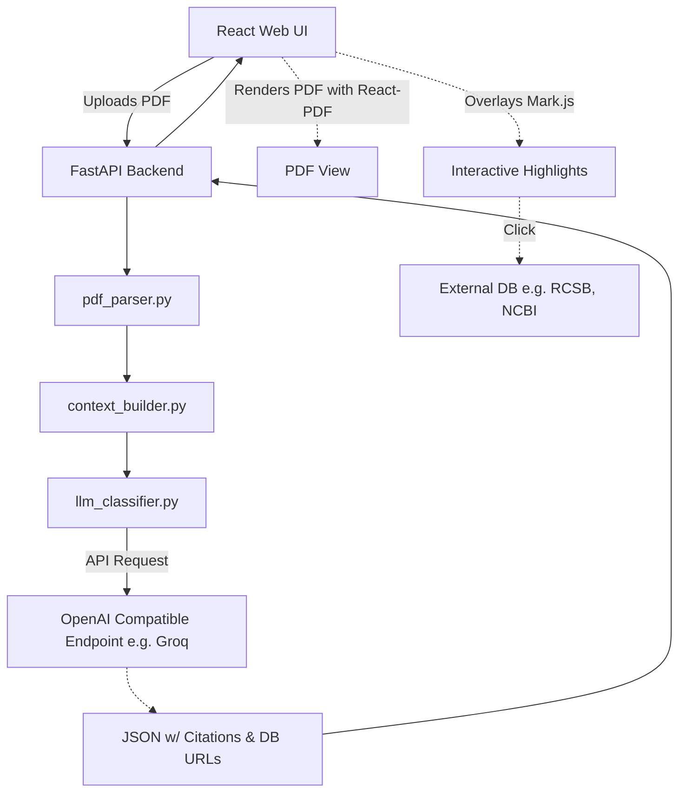

# Scientific Data Citation Extractor

MDC (Meta Data Citation) is an advanced extraction tool that identifies, extracts, and classifies data citations and database accession IDs from scientific articles (PDFs). It uses a hybrid approach of regex matching, heuristic context extraction, and LLM classification to categorize data citations into **Primary** and **Secondary** data sources.

## Core Features

- **Robust PDF Parsing**: Leverages `PyMuPDF` (backend) to extract text with visual layouts intact, and `react-pdf` (frontend) for accurate rendering.
- **Hybrid Extraction Engine**: Combines strict Regex matching (for 35 distinct biological/chemical databases) and explicit PDF hyperlink extraction (for DOIs).
- **Intelligent Context Clustering**: Extracts dynamic text windows around citations and handles complex tabular data structures effectively.
- **LLM API Integration**: Uses a unified `APIClassifier` compatible with any OpenAI-like endpoint (e.g. Groq, Together). Built-in rate-limiting and retry logic ensure robust processing.
- **Modern Interactive Web UI**: 
  - Drag-and-drop web interface built with React (Vite) featuring modern glassmorphism and beautiful dark mode aesthetics.
  - Interactive PDF highlighting using `mark.js` overlaid dynamically on the PDF pages.
  - **Dynamic External Links**: Accession IDs and DOIs are automatically mapped to their respective databases (e.g. GenBank, PDB, AlphaFold). Clicking on an ID in the right-side panel **or directly on the highlighted text in the PDF** opens the corresponding database record in a new tab.
  - **Visibility Toggles**: Users can toggle the visibility of individual citations or entire categories right on the PDF. State is preserved.
  - Full-text search and navigation through citations directly in the document.

## What is a Data Citation?

In this project, data citations are classified into two categories:
- **Primary**: Raw or processed data generated as part of the paper, specifically for the study.
- **Secondary**: Raw or processed data derived or reused from existing records or published data.

---

## Local Setup & Development

This project uses `uv` for fast Python dependency management and `npm` for the frontend.

### Backend Setup
1. Create a `.env` file in the root directory (you can copy `.env.example`) and configure your LLM endpoint:
   ```bash
   LLM_API_KEY="your-api-key-here"
   LLM_BASE_URL="https://api.groq.com/openai/v1"
   LLM_MODEL_NAME="llama-3.3-70b-versatile"
   RATE_LIMIT_RPM=30
   RATE_LIMIT_TPM=12000
   ```
2. Install dependencies and start the backend:
   ```bash
   uv sync
   uv run python -m localhost
   ```

### Frontend Setup
```bash
cd frontend
npm install
npm run dev
```

## Architecture Overview

### Extraction Pipeline (Backend)

1. **PDF Reading & Recollecting**: 
   Blocks of text are parsed using `page.get_text('dict')` from `fitz` (PyMuPDF). To fix broken context across pages, text is sorted by font size in descending order and concatenated.
2. **DOI & ID Extraction**: 
   DOIs are found via internal PDF hyperlinks and regex with post-filtering. Accession IDs for 35 distinct databases (e.g. GenBank, PDB, CATH) are found using fine-tuned regex patterns. Ambiguous or "dangerous" IDs are verified by checking keyword neighborhoods or using an LLM.
3. **Context Window Creation**: 
   A dynamic text window is extracted around the citations. Accession IDs are clusterized using a density-based algorithm, and if they appear inside a table, the main context is augmented with the table number.
4. **LLM Classification**: 
   Verified citations are classified into `Primary` or `Secondary` data sources using an instruction-tuned LLM via API (e.g. Llama 3).
5. **Database URL Mapping**: 
   The pipeline dynamically matches the matched regexes to 35 pre-configured URL templates, embedding actionable external URLs into the final JSON payload.

### Interactive UI (Frontend)

